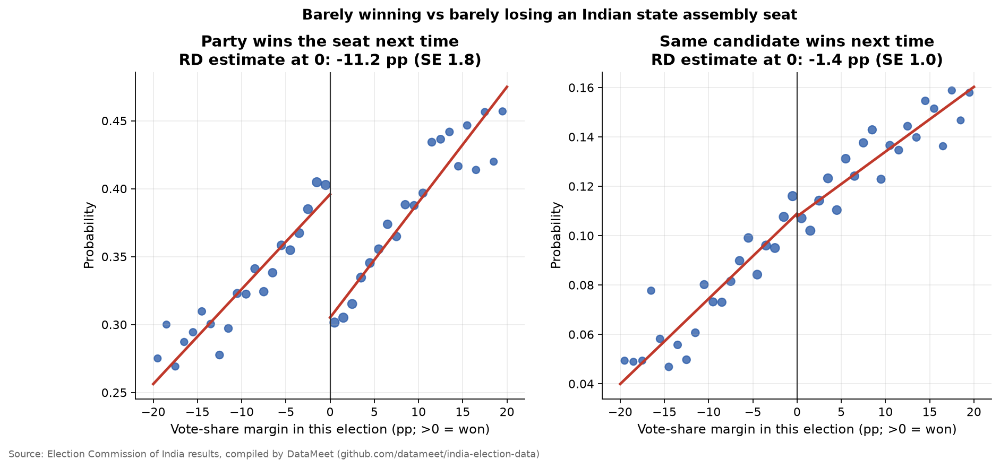
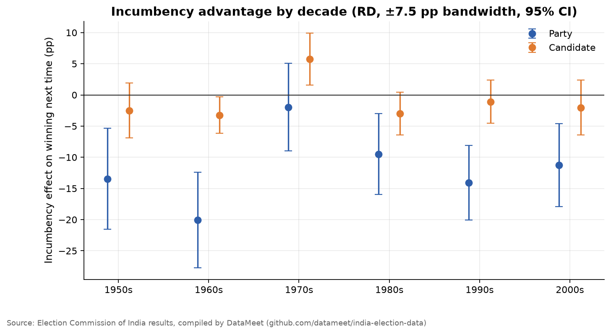
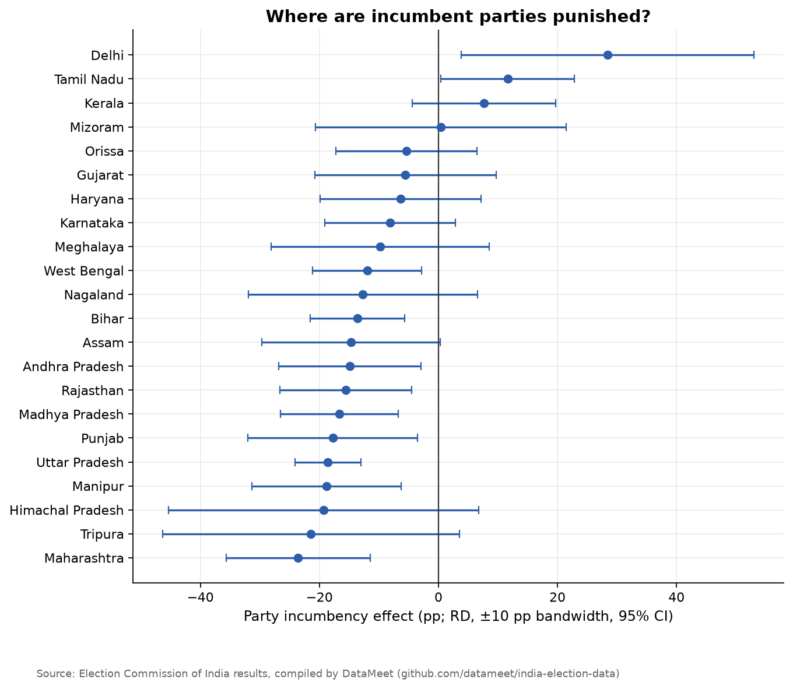

# Do Indian Voters Punish Incumbents? Evidence from Close Elections

In the US, holding office is an advantage: incumbents win again far more often than challengers. Indian politics has the opposite folk wisdom, **"anti-incumbency"**: voters throw out whoever holds the seat. The folk version can't separate two things. Incumbents may lose *because* they hold office, or they may lose because the kinds of candidates and parties who win are different to begin with.

This repo estimates the **causal** effect of incumbency using a **regression discontinuity design (RDD)**. It compares parties that *barely* won an assembly seat with parties that *barely* lost it. Within a couple of percentage points, who wins is close to a coin toss, so any jump in the chance of winning the *next* election at a margin of exactly zero is caused by incumbency itself.

## Data
Constituency-level results for **every Indian state assembly election** in the dataset: about 400,000 candidate records from 30 states and union territories, 1951 onwards. The source is the Election Commission of India, compiled by [DataMeet](https://github.com/datameet/india-election-data).

For each race: vote shares, winner and runner-up, and the margin between them. Each seat is linked to the **next** election in the same state and constituency. Seats redrawn by delimitation, where the constituency name changes, drop out.

## Method
- **Running variable:** a party's vote-share margin, positive if it won and negative if it came second.
- **Outcomes:** (1) the party wins the same seat next time; (2) the same candidate wins next time.
- **Estimator:** local linear regression with a triangular kernel, separate slopes on each side of zero, and SEs clustered by constituency. Main bandwidth ±5 pp, with robustness from ±2 to ±10 pp.
- **Placebo:** winning today cannot cause *past* wins, so the same design is applied to "did this party win last time?". It should show no jump.
- **Heterogeneity:** estimates by decade and by state.

## Results
<!-- RESULTS:START -->
_Auto-generated by `run.py` on 2026-09-25. Numbers refresh whenever the pipeline re-runs._

### Headline numbers (±5 pp bandwidth)

- **Party incumbency effect:** barely winning a seat changes the party's chance of winning it next time by **-11.2 pp** (95% CI -14.7 to -7.8; N = 18,682).
- **Candidate incumbency effect:** **-1.4 pp** (95% CI -3.3 to +0.5).
- Barely-winning candidates are **+6.2 pp** more likely to contest again. Among those who do, the effect on winning is **-17.5 pp** (not causal: who re-runs is selected).
- Placebo (winning *this* time should not change whether the party won *last* time): **-2.1 pp** (p = 0.23).
- Coverage: 30 states/UTs, elections 1951–2008, 81,910 party-race observations with a matched next election.

### Robustness to bandwidth

| Outcome | Bandwidth (pp) | Effect (pp) | SE (pp) | p | N |
|---|---|---|---|---|---|
| Party | 2.00 | -9.17 | 2.69 | 0.00 | 7843 |
| Candidate | 2.00 | -0.68 | 1.54 | 0.66 | 8660 |
| Party | 3.00 | -9.77 | 2.24 | 0.00 | 11530 |
| Candidate | 3.00 | -1.09 | 1.27 | 0.39 | 12724 |
| Party | 5.00 | -11.23 | 1.76 | 0.00 | 18682 |
| Candidate | 5.00 | -1.41 | 0.98 | 0.15 | 20590 |
| Party | 7.50 | -11.66 | 1.47 | 0.00 | 26570 |
| Candidate | 7.50 | -1.12 | 0.81 | 0.17 | 29240 |
| Party | 10.00 | -11.59 | 1.29 | 0.00 | 33590 |
| Candidate | 10.00 | -1.11 | 0.71 | 0.12 | 36950 |

### By decade (±7.5 pp)

| Decade | Party effect | Candidate effect | N (party) |
|---|---|---|---|
| 1950s | -13.5 | -2.5 | 1560 |
| 1960s | -20.0 | -3.2 | 3830 |
| 1970s | -2.0 | +5.8 | 3823 |
| 1980s | -9.5 | -3.0 | 5524 |
| 1990s | -14.1 | -1.1 | 6432 |
| 2000s | -11.2 | -2.0 | 5401 |

### Figures

**RD plots**



**Incumbency effect by decade**



**By state**



<!-- RESULTS:END -->

### What it means
- **Anti-incumbency is real, and it hits parties, not people.** A party that narrowly wins a seat is about 11 percentage points *less* likely to hold it next time than a party that narrowly lost. The estimate is stable across bandwidths and the placebo shows no jump. That rules out the worry that close winners were different to begin with.
- For individual candidates the effect is close to zero once the outcome is simply "wins next time". Narrow winners are slightly *more* likely to run again, so the candidate-level penalty is hidden by who chooses to recontest.
- The disadvantage has been present in almost every decade, the 1970s being the exception. It varies widely across states.
- This matches Uppal (2009) and Linden (2004) on India and is the reverse of the US pattern (Lee 2008). A likely reason is weak delivery by state governments. Voters use the seat-holding party as a proxy for performance they cannot observe directly.

## Reproduce
```bash
pip install -r requirements.txt
python run.py
```

## Limitations
- The compiled dataset ends with the early-2010s state elections. The GitHub Action re-runs automatically if DataMeet extends it.
- Candidates are matched on exact normalised names, so spelling variants across years undercount candidate re-runs and re-wins. The party-level result doesn't depend on this.
- Party splits and renamings (e.g. Janata Party → Janata Dal) count as the party "losing" the seat.
- Delimitation (1976, 2008) changes constituencies. Seats are matched by name only, so redrawn seats drop out.

## References
- Lee, D. (2008). *Randomized experiments from non-random selection in U.S. House elections.* Journal of Econometrics.
- Linden, L. (2004). *Are incumbents really advantaged? The preference for non-incumbents in Indian national elections.* Working paper.
- Uppal, Y. (2009). *The disadvantaged incumbents: estimating incumbency effects in Indian state legislatures.* Public Choice.
- Cattaneo, M., Idrobo, N. & Titiunik, R. (2020). *A Practical Introduction to Regression Discontinuity Designs.* Cambridge University Press.
